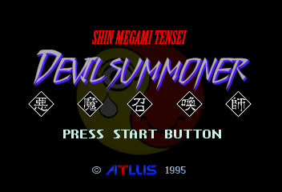
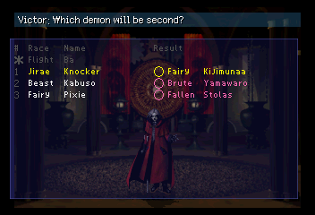
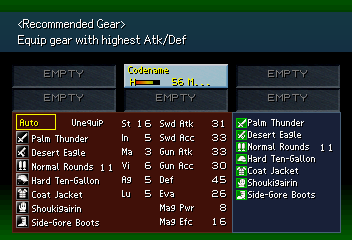
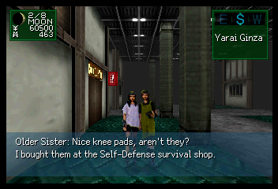
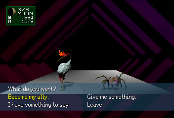
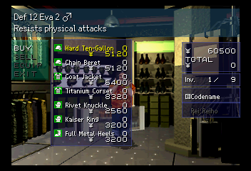
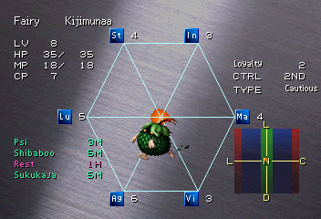
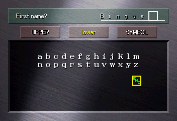

# Devil Summoner Translation Tools

> **This is not a finished translation or patch. It is not yet intended for release.**

This repository contains translation and modification tools for *Shin Megami
Tensei: Devil Summoner*. It can currently produce a functional English build of
the Sega Saturn Rev. B game and its *Akuma Zensho* compendium disc, although the
result has not yet received comprehensive translation review or runtime
testing. PSP support is planned but is not implemented in this repository yet.

The project is intended to provide a strong, approachable foundation for
translating the game into other languages or modifying and refining the
included English translation.

## Project status

| Target | Build status | Runtime status |
| --- | --- | --- |
| Sega Saturn Rev. B game | Complete configured build | Functional, but not comprehensively reviewed or playtested |
| Sega Saturn *Akuma Zensho* | Complete configured build for every proved text and visual span | Structurally verified; runtime playtesting remains |
| PSP | No build implementation | Planned |

"Complete configured build" means the repository can regenerate and verify all
translation work currently represented here. It does not mean every English
line or image has received final editorial review, nor that every path through
either disc has been tested in game.

## Package status

| Package | Current responsibility |
| --- | --- |
| `assets/text` | Canonical shared text, typed templates, semantic identities, and consumer specifications |
| `saturn/text` | Lossless catalogues for 16,141 game records and 1,605 compendium records, plus the file-backed EVENT, battle, facility, and COMP repackers |
| `saturn/font` | Eight game-font definitions, one identity-preserving compendium definition, generated atlases, and runtime metrics |
| `saturn/engine` | Twenty-four checked surface builds covering the translated executable consumers, lossless FMV subtitles, and the complete proved compendium text inventory |
| `saturn/visual` | 2,365 game image views and 295 classified compendium image structures, with sparse tracked replacements |
| `saturn/rom` | Verified extraction and transactional rebuilding of both Saturn discs |
| `psp` | Initial PSP font-resource catalogue and codecs; text, engine, visual, UMD publication, and a build workflow remain to be ported |
| `tools` | Local browser-based translation editing, bound-consumer validation, and exact-font surface previews |

The remaining work is chiefly translation review and playtesting, semantic
ownership for visible wording in artwork, a handful of deliberately unresolved
physical records, unmeasured layout limits, and the future PSP workflow. The
package READMEs distinguish these boundaries from implemented
features.

## AI Disclosure

This repository was developed with the assistance of AI tools. While I believe that current AI products are inflicting tremendous social, economic, and environmental harms, I also believe that, when used and deployed responsibly, the underlying technology has genuine potential and value for humanity, particularly in the fields of open-source software development, preservation, and accessibility.

If you're dissatisfied with this, I encourage you to fork this repo, or otherwise create your own tools, translation, and/or documentation. I claim no intellectual ownership of the code available here.

And if you believe that a technology like AI is fundamentally theft, no matter how it is deployed, [I would recommend giving this a read.](https://archive.org/details/in.ernet.dli.2015.124455)

## Getting Started

### Requirements

- Python 3.10 or newer
- [Pillow](https://pypi.org/project/pillow/)
- Legally obtained copies of both supported Saturn discs:
  - *Shin Megami Tensei: Devil Summoner* (Japan, Rev. B)
  - *Shin Megami Tensei: Devil Summoner - Akuma Zensho* (Japan)

Install Pillow into the Python environment used for the build if it is not
already available:

```powershell
python -m pip install Pillow
```

Pillow is used by the font and visual packages and by the integration checks
that compose engine-owned SAVE/LOAD bytes with their final image overlays.

### 1. Adding the original game images

Place the untouched BIN/CUE track sets for both discs in
[`saturn/rom/original/`](saturn/rom/original/README.md). The expected filenames,
track layouts, sizes, and SHA-256 hashes are recorded in
[`saturn/rom/discs.json`](saturn/rom/discs.json). The build rejects media that
does not match those definitions.

Original and generated disc data is ignored by Git. Do not commit or
redistribute it.

You can extract and then verify both discs with:

```powershell
python -B saturn/rom/extract.py
python -B saturn/rom/extract.py --check
```

Extraction creates editable mirrors under `saturn/rom/extracted/`. A normal
top-level build restores those mirrors from the original media before applying
the tracked translation, so do not keep authored changes there.

### 2. Editing the translation

#### Text Editing

Edit the `translation` values in the JSON files under
[`assets/text/`](assets/text/README.md). These are the canonical,
platform-neutral assets; files under `saturn/text/corpus/` are extracted binary
evidence and are not the translation interface.

Keep each field's `reference` text and structural tokens intact unless you are
deliberately changing the source mapping. Tokens such as `{n}` represent game
controls rather than literal text. Saturn bindings connect each authored field
to its physical records, while surface definitions enforce the known encoding,
width, row, and capacity limits. See the
[text tooling documentation](saturn/text/README.md) and
[consumer specifications](assets/consumers.md) before adding fields or changing
layout-sensitive text.

The local translation editor provides a searchable view of these same canonical
assets, checks every mapped Saturn consumer, previews supported surfaces with
the generated game fonts, and provides language projects for importing a
typeface, automatically assigning required characters to editable runtime
slots, and comparing original and modified font atlases:

```powershell
python -B -m tools.editor
```

It is also available as **Open Translation Editor** in the repository's VS Code
launch configurations. See [`tools/README.md`](tools/README.md) for editor-specific
details.

#### Image Editing

Editable Saturn images live under `saturn/visual/modified/<disc>/`. Existing
files there are sparse tracked replacements. To work on another image, first
run the visual extractor, copy the corresponding PNG from
`saturn/visual/extracted/<disc>/` to the same relative path under `modified/`,
and edit that copy:

```powershell
python -B saturn/visual/extract.py all
python -B saturn/visual/repack.py all
python -B saturn/visual/repack.py all --check
```

Do not edit the generated `extracted/` baseline or the manifest hashes by hand.
The [visual documentation](saturn/visual/README.md) describes supported formats,
shared images, stitched textures, and palette-limited title assets.

#### Font Editing & Additional Language Notes

Open-source typefaces and their licenses are stored under
[`assets/font/`](assets/font/README.md). Per-disc font definitions under
`saturn/font/config/` control source typefaces, replacement glyphs, packed
formats, metrics, and installation targets.

```powershell
python -B saturn/font/extract.py all
python -B saturn/font/repack.py all
python -B saturn/font/repack.py all --check
```

Supporting another language may require coordinated changes to the font maps,
text encodings, engine renderers, and individual consumer limits; changing only
the typeface is not necessarily sufficient. Consult the
[font documentation](saturn/font/README.md), text surface definitions, and
consumer specifications for the relevant screen.

### 3. Building the patched images

Inspect the complete build before running it:

```powershell
python -B saturn/build.py --plan
```

Then build both translated discs:

```powershell
python -B saturn/build.py
```

This restores the extracted mirrors, generates and installs fonts, text,
engine patches, and visual replacements, then rebuilds and structurally verifies
both disc sets. Existing populated build directories are replaced by this
top-level workflow. Outputs are written to:

```text
saturn/rom/build/game/
saturn/rom/build/compendium/
```

After a successful build, verify that every generated and installed artifact is
current with:

```powershell
python -B saturn/build.py --check
```

Test rebuilt images with a compatible emulator or original hardware. The build
produces complete disc images for local testing, not a redistributable patch.

## Development and Validation

The focused test suites use Python's standard `unittest` runner:

```powershell
python -m unittest discover -s saturn/font/tests -v
python -m unittest discover -s saturn/text/tests -v
python -m unittest discover -s saturn/engine/tests -v
```

Some integration checks require the verified private disc inputs. The build
configuration itself can be inspected without them using `--plan`,
`--list-steps`, and `--list-profiles`.

## Documentation

- [Shared text asset model](assets/text/README.md)
- [Language projects](assets/languages/README.md)
- [Text consumer specifications](assets/consumers.md)
- [Saturn ROM extraction and rebuilding](saturn/rom/README.md)
- [Saturn text extraction and repacking](saturn/text/README.md)
- [Saturn engine patches](saturn/engine/README.md)
- [Saturn font generation](saturn/font/README.md)
- [Saturn visual extraction and repacking](saturn/visual/README.md)
- [PSP package status](psp/README.md)

Generated directories are deliberately excluded from source control. In broad
terms, `assets/` owns shared authored material, while `saturn/` owns the
platform-specific bindings, formats, patches, and build workflow.

## License

Project-authored source code and documentation use the BSD Zero Clause License.
Game-derived text and images and the preview screenshots are excluded, and
third-party fonts retain their own terms. See [LICENSE](LICENSE) for the
complete scope.

## Preview/Example Screenshots

These screenshots come from the mature Saturn reference build that this
tooling is intended to reproduce. The FMV subtitle presentation is now built
losslessly by the Saturn engine surface rather than burned into the movie.

| **Title** | **Fusion Table** |
| :---: | :---: |
|  |  |
| **Equipment Screen** | **Event Choice** |
|  |  |
| **3D Field Event** | **Inventory** |
|  |  |
| **Negotiation Choice** | **Shop** |
|  |  |
| **Settings** | **Status** |
|  |  |
| **FMV Subtitles** | **Name Input** |
|  |  |
